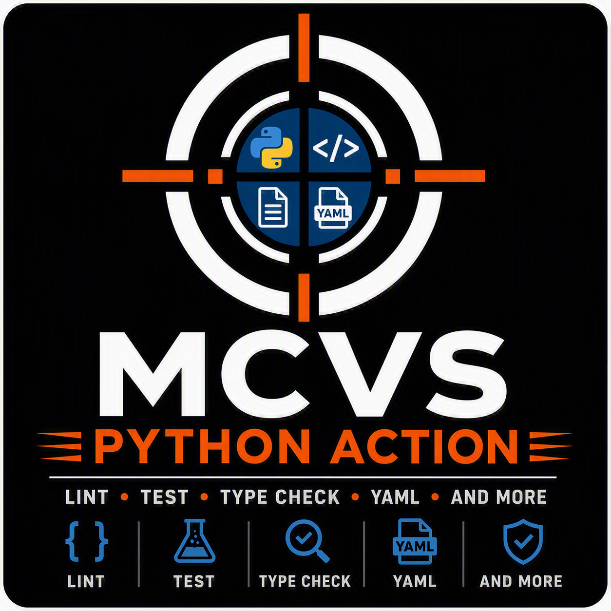

# MCVS-python-action

[](https://github.com/schubergphilis/mcvs-python-action/releases)
[](LICENSE)



Mission Critical Vulnerability Scanner (MCVS) Python Action. Create Python code without high and critical vulnerabilities.

## Usage

Create a `.github/workflows/python.yml` file with the following content:

```yaml
---
name: Python
"on": push
permissions:
  contents: read # write if pyinstaller-binary-name is non-empty
jobs:
  MCVS-python-action:
    runs-on: ubuntu-24.04
    steps:
      - uses: actions/checkout@some-hash # v4.2.2
        with:
          persist-credentials: false
      - uses: schubergphilis/mcvs-python-action@some-hash # v0.2.1
        with:
          token: ${{ secrets.GITHUB_TOKEN }}
```

<!-- markdownlint-disable MD013 -->

| Option                  | Default | Required | Description                                                                                                |
| :---------------------- | :------ | -------- | :--------------------------------------------------------------------------------------------------------- |
| linter                  |         |          | `ruff`, `flake8` or `none`. Defaults to ruff for uv projects, flake8 for pip. ruff must be a project dependency and any finding fails |
| package-manager         | auto    |          | `auto`, `uv` or `pip`. `auto` uses uv (`uv sync --all-packages --frozen`) when `uv.lock` exists, else pip |
| pyinstaller-binary-name |         |          | If populated, then a binary will be created using pyinstaller and attached to a release                    |
| pyinstaller-entrypoint  | main.py |          | The Python script that pyinstaller turns into a binary                                                     |
| type-check-args         |         |          | Arguments for the type checker, e.g. `--strict packages/*/src`. Globs are expanded |
| type-checker            | none    |          | `mypy`, `pyright` or `none`. The type checker must be a project dependency |
| pytest-args             |         |          | Extra pytest arguments, e.g. `-m "not integration"`. Quoting works as in a shell |
| test-paths              |         |          | Paths to test, e.g. `packages/*/tests`. Defaults to pytest's own discovery |
| token                   |         | x        | GitHub token required for Docker registry authentication and uploading release assets (if building binary) |

<!-- markdownlint-enable MD013 -->

`persist-credentials: false` keeps the token out of `.git/config`, so
third-party packages installed from `requirements.txt` cannot read it. The
action receives the token only through the `token` input.

Define the Python version of the project by adding it to a `.python-version`
file.
